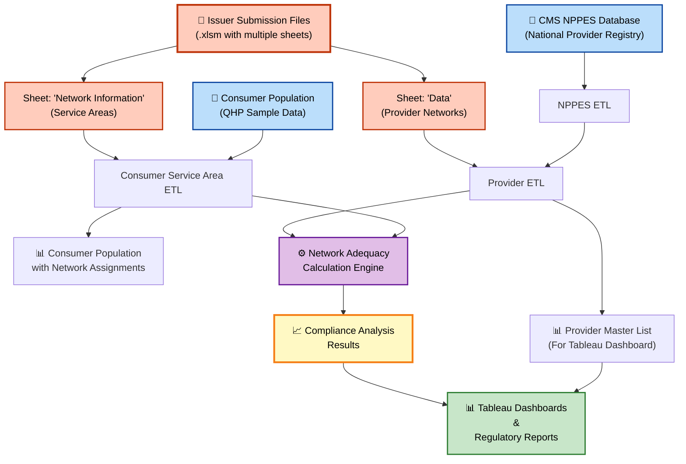

# Network Adequacy ETL Pipeline

## Overview

The Network Adequacy ETL pipeline processes issuer-submitted files and national provider data to produce datasets for the network adequacy calculation engine and dashboard reporting. The pipeline consists of three core ETL processes that transform raw submissions into geocoded, normalized datasets ready for compliance analysis.

## Data Flow



## Input Sources

### Primary Inputs: Issuer Submission Files

Issuers submit **multi-sheet Excel files** (`**/*.xlsm`) that contain both provider network and service area data. These files are processed by different ETL processes that read different sheets:

1. **"Data" Sheet** (Provider network information)
   - Provider NPIs, names, addresses, and specialty codes
   - Network assignments for each provider
   - Read by: Provider ETL

2. **"Network Information" Sheet** (Service area coverage)
   - Geographic coverage definitions (full county or ZIP-code-based)
   - Network identifiers and coverage areas
   - Read by: Consumer Service Area ETL

**File Location**: `PY2026_as_of_2026213/issuer_uploaded_files/` or `Issuer_Submissions/{submission_date}/`

### Supporting Data Sources

- **NPPES Data**: National provider registry from CMS
- **Consumer Population**: QHP sample population file (Parquet format)
- **Administrative Boundaries**: US counties shapefile for spatial analysis
- **Reference Tables**: Network mappings, specialty code definitions, deactivated NPIs

---

## ETL Processes

### 1. NPPES ETL

**Purpose**: Extract and geocode provider data from the national NPPES database to supplement issuer submissions

**Key Steps**:
- Filter NPPES data to relevant geographic areas (PA, NY, NJ, OH, MD, WV, DE)
- Map NUCC taxonomy codes to network adequacy specialty codes
- Standardize and clean provider addresses
- Geocode provider locations using AWS Location Service
- Cache geocoding results for performance

**Outputs**:
- `nppes_geo_output_{timestamp}.csv` - Geocoded NPPES provider data

**Execution**: Two-step process (AWS Lambda cleaning + local geocoding script)

**Documentation**: [nppes_etl.md](nppes_etl.md)

---

### 2. Provider ETL

**Purpose**: Consolidate issuer provider submissions and NPPES data into a comprehensive provider master list

**Key Steps**:
- Load provider data from issuer submission files
- Merge with geocoded NPPES data for supplemental coverage
- Join with master address geocoding table for coordinates
- Perform spatial analysis to assign providers to counties
- Apply distance-based filtering (state buffer zone)
- Remove deactivated NPIs
- Split output for modeling and dashboard use

**Outputs**:
- `{today}_PID_Providers.csv` - Full provider dataset for network adequacy modeling
- `{today}_Provider_Master_List_PID.csv` - Filtered dataset for Tableau dashboard (within buffer only)
- `{today}_Addresses_to_Geocode.csv` - Addresses requiring geocoding (if any)

**Execution**: Python script (`Provider_ETL.py`)

**Documentation**: [provider_etl.md](provider_etl.md)

---

### 3. Consumer Service Area ETL

**Purpose**: Assign network identifiers to consumers based on issuer service area definitions

**Key Steps**:
- Load consumer population data from Parquet file
- Round latitude/longitude coordinates to 4 decimal places
- Process issuer service area submissions (full county and partial county)
- Match consumers to networks based on geographic rules:
  - Full county: Match by county name
  - Partial county: Match by county name + ZIP code
- Combine and deduplicate network assignments per consumer

**Outputs**:
- `20250811_QHP_Sample_Population_PY26_PA_Final_v3.csv` - Consumer population with network assignments

**Execution**: Python notebook/script (`Consumer_Service_Area_ETL.ipynb` or `Service_Area_ETL.py`)

**Documentation**: [consumer_service_area_etl.md](consumer_service_area_etl.md)

---

## Execution Order

Follow this sequence to run the complete ETL pipeline:

### Step 1: NPPES ETL (Optional - Run when NPPES data is updated)
```bash
# Step 1a: Deploy and run NPPES cleaning Lambda (AWS)
# Upload raw NPPES file to s3://bucket/nppes/raw_input/{Year}/{Month}/
# Lambda automatically processes and outputs to s3://bucket/nppes/result/cleaning_result/

# Step 1b: Run geocoding script locally
cd scripts/nppes_etl
python nppes_geocode_parallel.py
```

**Frequency**: Monthly or quarterly (when CMS releases NPPES updates)  
**Prerequisites**: Raw NPPES file uploaded to S3, taxonomy mapping file updated

---

### Step 2: Provider ETL
```bash
cd scripts
python Provider_ETL.py
# Or run the Jupyter notebook: Provider_ETL.ipynb
```

**Frequency**: After each issuer submission cycle  
**Prerequisites**: 
- Issuer submission files (reads "Data" sheet) in `PY2026_as_of_2026213/issuer_uploaded_files/`
- NPPES geocoded data (if supplementing with NPPES)
- Master address geocoding table updated
- Deactivated NPI report downloaded from CMS

**Outputs**:
- Provider master list for dashboard
- Full provider dataset for modeling

---

### Step 3: Consumer Service Area ETL
```bash
cd scripts
python Service_Area_ETL.py
# Or run the Jupyter notebook: Consumer_Service_Area_ETL.ipynb
```

**Frequency**: After each issuer submission cycle (parallel with Provider ETL)  
**Prerequisites**:
- Consumer population Parquet file available
- Issuer submission files (reads "Network Information" sheet) in `Issuer_Submissions/{submission_date}/`
- Network information report (mapping file) updated

**Outputs**:
- Consumer population with network assignments

---

### Step 4: Network Adequacy Calculation Engine (Downstream)
```bash
cd scripts
python Network_Adequacy_Model_Sanitized.py
python PBM_Network_Adequacy_Modeling_Sanitized.py
```

**Prerequisites**:
- Provider master list (from Step 2)
- Consumer population with network assignments (from Step 3)
- Criteria requirements files uploaded

**Outputs**:
- Network adequacy compliance analysis results
- Time/distance calculations by specialty and geography
- Files for Tableau dashboard visualization
- Regulatory compliance reports

---

## ETL Output Files

The ETL pipeline produces the following datasets that feed the Network Adequacy Calculation Engine and Tableau dashboards:

### For Calculation Engine

1. **Full Provider Dataset** (`PID_Providers.csv`)
   - Complete provider inventory with geocoded locations
   - Network assignments and specialty codes
   - Used for: Time/distance calculations in compliance modeling

2. **Consumer Population** (`QHP_Sample_Population_PY26_PA_Final_v3.csv`)
   - Consumer locations with network assignments  
   - Used for: Determining which providers must be accessible to which consumers

### For Tableau Dashboards

1. **Provider Master List** (`Provider_Master_List_PID.csv`)
   - Geocoded provider locations with network assignments (filtered to service area)
   - Used for: Provider directory dashboard, geographic heatmaps

### Calculation Engine Outputs (to Tableau)

2. **Consumer Population** (`QHP_Sample_Population_PY26_PA_Final_v3.csv`)
   - Consumer locations with network assignments
   - Used for: Consumer access analysis (via calculation engine results)

3. **Network Adequacy Results** (from calculation engine)
   - Time/distance calculations between consumers and providers
   - Network compliance metrics by specialty and geography  
   - Used for: Regulatory compliance dashboards, gap analysis

---

## Data Quality

Data quality checks are performed at each stage:

- **NPPES ETL**: Validate taxonomy mappings, geocoding success rate
- **Provider ETL**: Check for duplicate NPIs, verify county assignments, validate coordinates
- **Consumer Service Area ETL**: Verify network assignment coverage, check for orphaned consumers

Quality reports are generated in `data_quality_report/` directory.

---

## Related Documentation

- [Provider ETL Details](provider_etl.md)
- [Consumer Service Area ETL Details](consumer_service_area_etl.md)
- [NPPES ETL Details](nppes_etl.md)
- [PBM Network Adequacy Analysis](../pbm/pbm_network_adequacy_analysis.md)

---

## Troubleshooting

### Common Issues

**NPPES geocoding rate < 95%**
- Check AWS Location Service quotas
- Verify address formatting in cleaning step
- Review geocoding cache for stale entries

**Provider master list missing providers**
- Verify issuer submission files have "Data" sheet with expected structure
- Check for deactivated NPIs filtering too aggressively
- Confirm state buffer distance is appropriate

**Consumer service area mismatches**
- Validate county name standardization (e.g., "St." vs "Saint")
- Verify ZIP code cleaning (remove leading zeros issues)
- Check for partial county coverage definitions

**Network ID assignment failures**
- Confirm network information report is up to date
- Verify issuer identifier formatting consistency
- Check for missing network mappings in reference file

---

## Contact

For questions or issues with the ETL pipeline, contact the Network Adequacy team.
