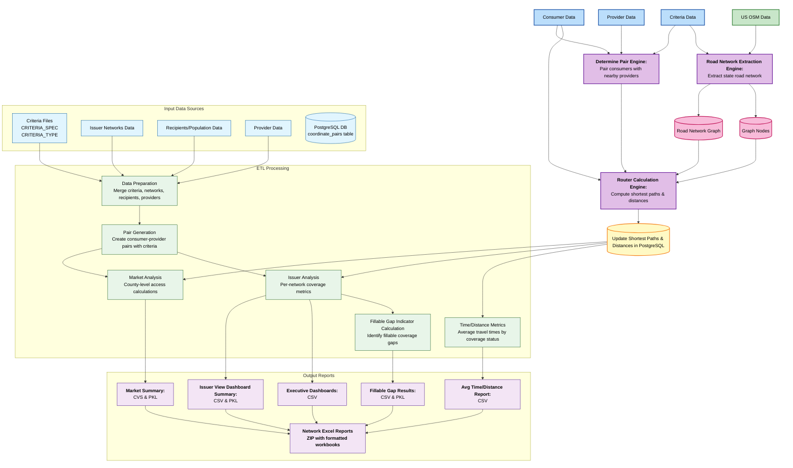

# Network Adequacy Engine Pipeline Overview

## Overview
TODO
The Network Adequacy Engine pipeline processes issuer-submitted and provider data to generate distance-based insights for compliance analysis and reporting. It is organized into three core engines that identify eligible consumer–provider pairs, extract the road network, and compute shortest path distances to support network adequacy evaluation.

## Data Flow

## Input Sources

### Primary Inputs: 

1. Criteria Files
   * CRITERIA_SPEC: 20250417_T_NET_ADQ_CRITERIA_SPEC_PA.csv 
   * CRITERIA_TYPE: 20250417_T_NET_ADQ_CRITERIA_TYPE_PA.csv   Columns: 'GRP_CDE_SPECLTY_PRIM','DISPLAY_CAT','CDE_SPECLTY_PRIM','TYPE_SPECLTY_PRIM','NAM_CRITERIA'
   * Merge CRITERIA_SPEC and CRITERIA_TYPE on 'NAM_CRITERIA' and finally selecting 'NAM_CRITERIA','CDE_SPECLTY_PRIM','criteria_category' columns as input for Data Preparation step.

2. Issuer Network Data: 
   * For each individual issuer (issuer_identifier_number) take the first non duplicated data.
   * Columns: ['period','issuer_name','issuer_identifier_number','any_dental','Updated File Name','PID_network_name']
   * Table: 20250815_Network_Information_Report.xlsx   sheet_name='Network Information Report'

3. Recipients/Population Data
   * Read csv file
   * Columns: [consumer_id','zip', 'countyssa', 'countyfips']
   * Table: 20250811_QHP_Sample_Population_PY26_PA_Final_v3.csv

4. Provider Data
   * Table: 20251114_PID_Providers.csv

### Supporting Data Sources

- **Postgres Database**: Database 

---

## Data Preparation
* Prepare data for the further analysis by merging the respctive input files

## Market Analysis Metrics
* all_summaries_market_final_{model run date}.pkl
* gap_report_results_all_market_final_{model run date}.csv

## Issuer Analysis
* gap_report_results_all_{model run date}.csv 
* all_summaries_{model run date}.pkl
* {model run date}_PID_Network_Adequacy_Executive_Dashboard_Data.csv

## Fillable Gap Indicator Calculation
* fillable_gap_results_final_{model run date}.csv
* fillable_gap_results_final_{model run date}.pkl

## Time/Distance Metrics
* avg_time_distance_report_{model run date}.csv

**Outputs**:
* 20251205_Summary_Reports.zip
* Updated_Gap_Reports.zip