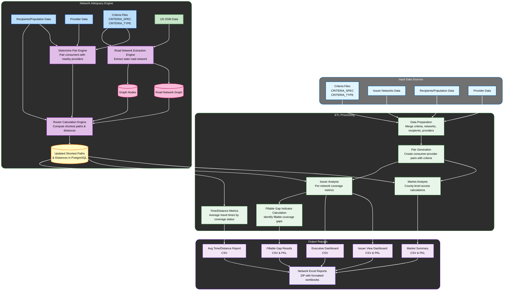

# Network Adequacy Sanitiezed Pipeline Overview

## Overview
This pipeline processes healthcare network adequacy data by loading criteria, network, consumer, and provider information, then calculating coverage metrics at both county and issuer levels. It identifies fillable coverage gaps, computes average travel times, and generates formatted Excel reports for each insurance network. The final output is a timestamped ZIP file containing network-specific workbooks with failing counties and behavioral health opportunity tabs

## Data Flow

## Input Sources

### Primary Inputs: 

1. Criteria Files
   * CRITERIA_SPEC: 20250417_T_NET_ADQ_CRITERIA_SPEC_PA.csv 
   * CRITERIA_TYPE: 20250417_T_NET_ADQ_CRITERIA_TYPE_PA.csv   Columns: 'GRP_CDE_SPECLTY_PRIM','DISPLAY_CAT','CDE_SPECLTY_PRIM','TYPE_SPECLTY_PRIM','NAM_CRITERIA'
   * Merge CRITERIA_SPEC and CRITERIA_TYPE on 'NAM_CRITERIA' and finally selecting 'NAM_CRITERIA','CDE_SPECLTY_PRIM','criteria_category' columns as input for Data Preparation step.

2. Issuer Network Data: 
   * For each individual issuer (issuer_identifier_number) take the first non duplicated data.
   * Columns: ['period','issuer_name','issuer_identifier_number','any_dental','Updated File Name','PID_network_name']
   * Table: 20250815_Network_Information_Report.xlsx   sheet_name='Network Information Report'

3. Recipients/Population Data
   * Read csv file
   * Columns: [consumer_id','zip', 'countyssa', 'countyfips']
   * Table: 20250811_QHP_Sample_Population_PY26_PA_Final_v3.csv

4. Provider Data
   * Table: 20251114_PID_Providers.csv

### Supporting Data Sources

- Postgres SQL Database
- Graph_pa.pkl: Road Network Graph
- Graph_nodes_pa.parquet: Road Network Graph Nodes

---

## Data Preparation
* **Criteria Merging:** Joins county criteria with specialty definitions on criteria name to create mapping between counties and individual specialty types with their requirements.
* **Specialty Roll-ups:** Maps individual specialties to group categories to enable analysis at both granular and summary levels.
* **Network Standardization:** Groups network records by identifier, creates dental coverage flag, and cleans issuer names to ensure consistent formatting.
* **Provider Expansion:** Duplicates providers for each roll-up specialty they belong to so they count toward both individual and group specialty metrics.
* **Consumer-Provider Pairs:** Creates master table linking consumers to applicable criteria by exploding network IDs and joining with network metadata and county requirements.
* Builds list of all county-network-criteria combinations for analysis by extracting unique combinations and expanding to include roll-up specialties.

## Market Analysis Metrics
* Splits counties into individual chunks to process covered consumers incrementally, preventing memory overload.
* Queries database for covered consumer-provider pairs filtered by county.
* Aggregates provider counts by specialty, county, and coordinates.
* Counts unique consumers covered per county and criteria, calculates access percentage.
* Calculates in-county providers and servicing providers per criteria.
* Merges access percentages with provider counts for complete market analysis.
* Concatenates results from all counties and saves to pickle and CSV.
    * all_summaries_market_final_{model run date}.pkl
    * gap_report_results_all_market_final_{model run date}.csv

## Issuer Analysis
* Loops through each network ID (excluding Cigna) to calculate metrics independently.
* Queries database for covered consumer-provider pairs filtered by network and expands to roll-up specialties.
* Counts covered consumers per county and criteria, calculates access percentage with 90% threshold.
* Counts in-county providers and servicing providers (any county) to determine provider requirements.
* Combines coverage and provider metrics to determine overall compliance (both requirements met).
* Saves per-network summaries to dictionary, pickle, and CSV.
    * gap_report_results_all_{model run date}.csv
    * all_summaries_{model run date}.pkl

* Issuer Dashboard: Transforms raw summaries into user-friendly format with network names, rating areas, and readable specialty names. Filters dental criteria for non-dental plans.
    * {model run date}_PID_Network_Adequacy_Issuer_Dashboard_Data.csv

* Executive Dashboard: Restricts CBC networks (like N03, N04, N05, N06) to specific counties, groups by issuer to aggregate coverage, joins with rating areas and specialty categories, and exports high-level view.
    * {model run date}_PID_Network_Adequacy_Executive_Dashboard_Data.csv

## Fillable Gap Indicator Calculation
* Creates a single DataFrame from all network summaries, keeping only rows where coverage is below 90%.
* Identifies consumers not covered for each network, county, and criteria using chunked processing.
* Determines whether uncovered consumers can be covered by adding nearby in-network providers. Classifies each gap into one of five categories:
    * No Data: No consumer data available for this county and criteria
    * No Gap: Coverage already meets or exceeds 90% threshold
    * Fillable By Single Provider: Adding one nearby provider would bring coverage to 90% or higher
    * Increase in Access by Single Provider: Adding one provider improves coverage but still below 90%
* For the specified criteria (MHF, S03, OPBH, DEN, POPBH), any gap that was initially classified as "Unfillable, No Increase In Access" is converted to "Fillable By Single Provider".
    * fillable_gap_results_final_{model run date}.csv
    * fillable_gap_results_final_{model run date}.pkl

## Time/Distance Metrics
* Loops through each county using parallel processing (2 workers) to find the closest provider for every consumer.
* Calculates average drive time and distance for each county, network, and criteria, grouped by coverage status:
    * With access (covered consumers)
    * Without access (uncovered consumers)
    * Overall (all consumers combined)
* Reshapes the data so each row contains all three coverage categories as columns (e.g., 'distance avg','distance avg with access','distance avg without access', 'time avg','time avg with access','time avg without access').
* Saves the final pivoted results to CSV, replacing null values with "N/A" for readability.
    * avg_time_distance_report_{model run date}.csv

## JOIN ALL METRICS TOGETHER INTO A SINGLE TABLE:
* Load result data from 'Fillable Gap Indicator Calculation', 'Issuer Analysis', ' Market Analysis Metric' sections.
* For the attached rollup criteria ('S03', 'DEN', 'OPBH', 'POPBH', 'MHF') sets their market access percentage to 100%.
* Combine Market Metrics, Issuer Summaries and Criteira data on 'county fips code' and 'criteria' and calculate 'perc_market' ('servicing in county'/'market analysis servicing in county')
* Opens '{model run date}_Summary_Reports.zip' ZIP file containing Excel templates named like '{model run date}_network_name.xlsx'.
    * For each network_name split overall summary data into two sets and save them into two respective sheets:
        * Set 1: Counties with coverage < 90%: Goes to **"Specialty Summary By County"** tab
        * Set 2: Behavioral health specialties with coverage ≥ 90%: Goes to **"BH Opportunities"** tab
    * Save the data with updtaed file names '{model run date}_{network_name}.xlsx' while preserving the original paths.
    * Bundles all updated Excel files into a new Zip file: {model run date}_Updated_Gap_Reports.zip

## Ouput:
* {model run date}_Updated_Gap_Reports.zip
