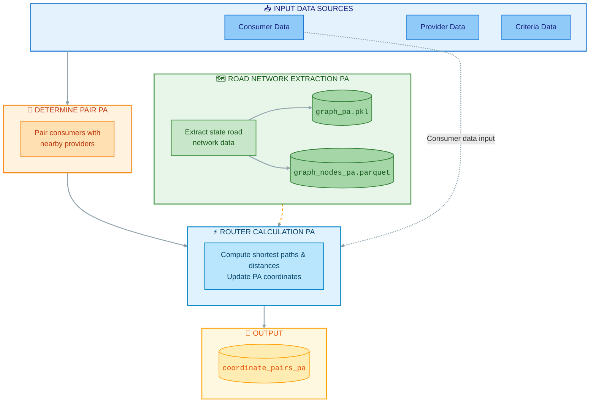

# Network Adequacy ETL Pipeline

## Overview

The Network Adequacy ETL pipeline processes issuer-submitted files and national provider data to produce datasets for the network adequacy calculation engine and dashboard reporting. The pipeline consists of three core ETL processes that transform raw submissions into geocoded, normalized datasets ready for compliance analysis.

## Data Flow



## Input Sources

### Primary Inputs: 

1. **Providers Data** (Provider network information)
   - Provider NPIs, names, addresses, and specialty codes

2. **"Consumer Data** (Service area coverage)
   - Geographic coverage definitions (full county or ZIP-code-based)

3. **"Criteria Data** (Service area coverage)
   - Drive time and distance requirements for provider specialty criteria and county type
   - CDE_COUNTY, Criteria, TME_DRVE, DISTANCE


### Supporting Data Sources

- **Administrative Boundaries**: US counties shapefile for spatial analysis


---

## Network Adequacy Calculation Engine (Downstream)
```bash
cd scripts
python Determine_Pairs_PA.py
python Road_Network_Extraction_PA.py
python Route_Calculation_PA.py
```


**Outputs**:
- Network adequacy compliance analysis results
- Time/distance calculations by specialty and geography
- Files for Tableau dashboard visualization
- Regulatory compliance reports

---

### Determine_Pairs_PA.py
   - Find consumer and provider pair that lies within the criteria distance.
   - Update all provider and consumer pair within all unique distance and criteria data in the postgres database in table: *Coordinate_pairs_pa*

### Road_Network_Extraction_PA.py
   - Extract the road network for the specified state.
   - Store the network graph as a serialized (pickle) file and the associated nodes dataset in Parquet format.

### Route_Calculation_PA.py;
   - Compute shortest paths and distances using the road network graph.
   - Update the computed results in the database table *Coordinate_pairs_pa*

